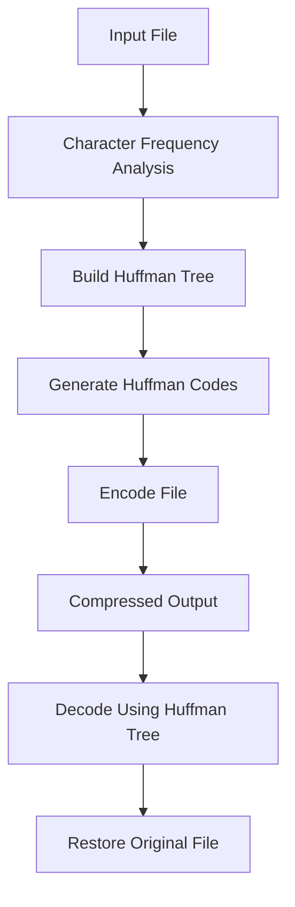

# 🗜️ Huffman File Compressor

A lossless text compression utility built in C++ using Huffman Coding. The project reduces storage requirements by assigning variable-length binary codes to characters based on their frequency while ensuring perfect reconstruction of the original file.

---

## 📊 Project Statistics

| Metric | Value |
|----------|----------|
| Compression Ratio | 48.3% |
| Reconstruction Accuracy | 100% |
| Dataset Tested | 20 MB |
| Characters Processed | 20M+ |
| Processing Time | 7.6 seconds |
| Compression Type | Lossless |

---

## ✨ Features

- Compress text files using Huffman Coding
- Restore original files through lossless decompression
- Frequency-based variable-length encoding
- File integrity verification
- Compression statistics reporting
- Command-line interface support

---

## 🛠️ Technologies Used

| Category | Technology |
|-----------|------------|
| Language | C++ |
| Data Structures | Hash Map, Priority Queue, Binary Tree |
| Algorithms | Huffman Coding, DFS Traversal |
| Concepts | Compression, Encoding, Decoding, File Handling |

---

## 📂 Project Structure

```text
huffman-file-compressor/
│
├── src/
│   ├── main.cpp
│   ├── HuffmanTree.h
│   ├── HuffmanTree.cpp
│   ├── Compressor.h
│   ├── Compressor.cpp
│   ├── Utils.h
│   └── Utils.cpp
│
├── samples/
│   ├── input.txt
│   ├── encoded.txt
│   └── output.txt
│
├── README.md
└── .gitignore
```

---

## ⚙️ How It Works



---

## 🧠 Compression Workflow


---

## 📈 Benchmark Results

| Metric | Result |
|----------|----------|
| Original Bits | 163,470,528 |
| Encoded Bits | 84,423,924 |
| Bits Saved | 79,046,604 |
| Compression Ratio | 48.3% |

### Storage Reduction

```text
Original Data

████████████████████████████████████████ 100%

Compressed Data

█████████████████████                    51.7%
```

---

## 💻 Usage

### Compress a File

```bash
./huff compress input.txt encoded.txt
```

### Decompress a File

```bash
./huff decompress encoded.txt output.txt
```

---

## 📋 Sample Output

```text
--- Compression Statistics ---

Original Characters : 20433816
Original Bits       : 163470528

Encoded Bits        : 84423924

Compression Ratio   : 48.35%

Time Taken          : 7.60 seconds

Throughput          : 2.56 MB/s
```

---

## ✅ Verification

The decompressed file is automatically validated against the original file.

```text
Restoration Accuracy : 100%

File Integrity       : PASSED
```

---

## 🚀 Future Improvements

- Binary file compression
- Bit-level storage optimization
- Custom `.huff` file format
- Tree serialization
- Directory compression support
- Multi-threaded encoding

---

## 👨‍💻 Author

**Neeti Kalola**

Built as a systems programming and data compression project using C++.